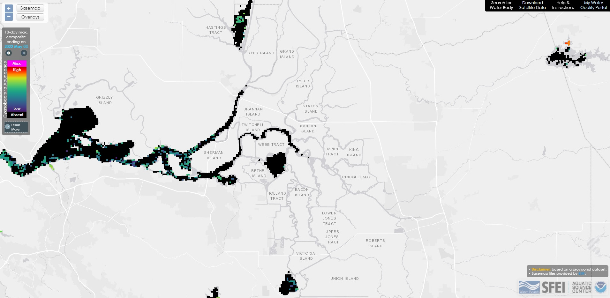

```{r setup, include = FALSE}
options(htmltools.dir.version = FALSE)
knitr::opts_chunk$set(warning = FALSE, message = FALSE)
```

# Satellite data for Harmful Algal Blooms

San Francisco Estuary Institute's (SFEI) HAB Satellite Analysis Tool: <https://fhab.sfei.org/>

Provides CyanoHAB abundance estimates for all of California using a Cyanobacteria Index (CI)

```{r print sfei image, echo = FALSE}

```

---

# Objective

- Pull out raster pixels of Cyanobacteria Index (CI) for four open water regions in the SF Estuary:
  - Liberty Island
  - Franks Tract
  - Mildred Island
  - Clifton Court Forebay


- Count the number of pixels in each region that fall within four CI categories (Low, Moderate, High, Very High) and two additional categories (Non-detect, Invalid or Missing)

- Repeat this procedure for every day with valid imagery between May-October in years 2020 and 2021

---
class: inverse, middle

# Simple Example

Download and process a single raster file

---

# Tools

- `stars` - importing and visualizing raster files

- `exactextractr` - extracting raster pixels using polygons, zonal statistics

- `sf` - importing, visualizing, and working with spatial data (polygons)

- `tidyverse` - general data manipulation and visualizing

---

# Download Raster File

```{r download raster}
library(stars)

fp_hab_sat <- "spatial_data/hab_satellite_2021-07-29.tif"
strs_hab_sat <- read_stars(fp_hab_sat)
```

---

# What is a stars object?

```{r print stars}
strs_hab_sat
```

---

# Modifying a stars object

```{r modify stars}
library(dplyr)

# Convert pixel attributes from factor to numeric
strs_hab_sat_c <- strs_hab_sat %>% 
  mutate(
    across(everything(), ~ as.numeric(as.character(.x)))
  )

strs_hab_sat_c
```

---

# What does it look like?

.pull-left[
#### Code:
```{r plot stars code right, fig.show = 'hide'}
library(ggplot2)
library(sf)

# Import CA boundary shapefile
sf_ca_bound <- 
  read_sf("spatial_data/CA_State_TIGER2016.shp") %>% 
  st_transform(crs = st_crs(strs_hab_sat_c))

# Plot satellite data
ggplot() + 
  geom_stars(data = strs_hab_sat_c) +
  scale_fill_viridis_b(name ="Cyano Index") +
  geom_sf(data = sf_ca_bound, alpha = 0, color = "black", size = 1) +
  theme_bw()
```
]

.pull-right[
```{r ref.label = 'plot stars code right', echo = FALSE}

```
]

---

# Crop raster using a bounding box


